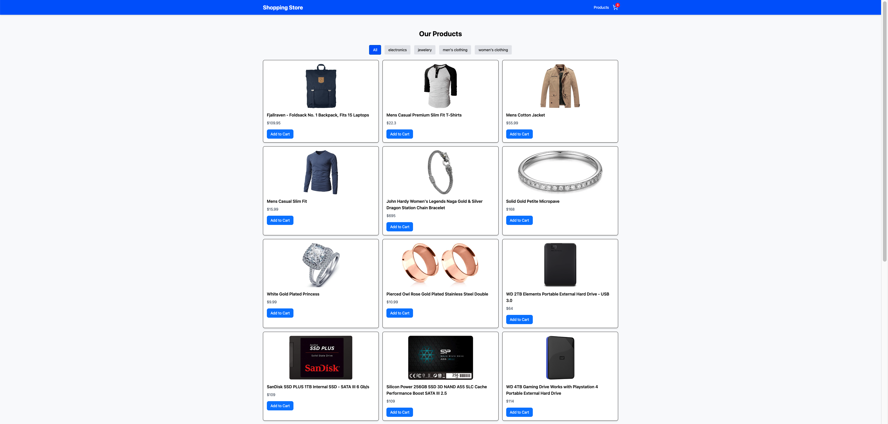
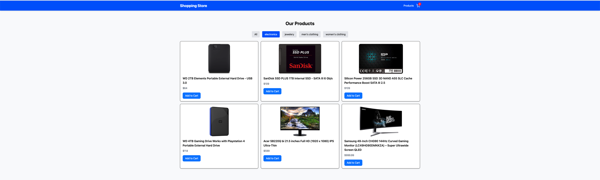
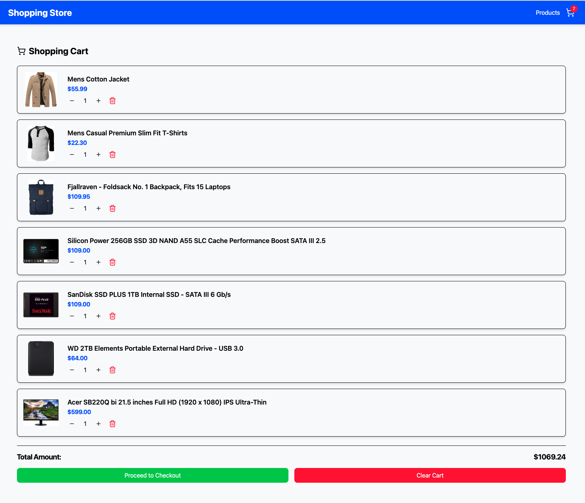
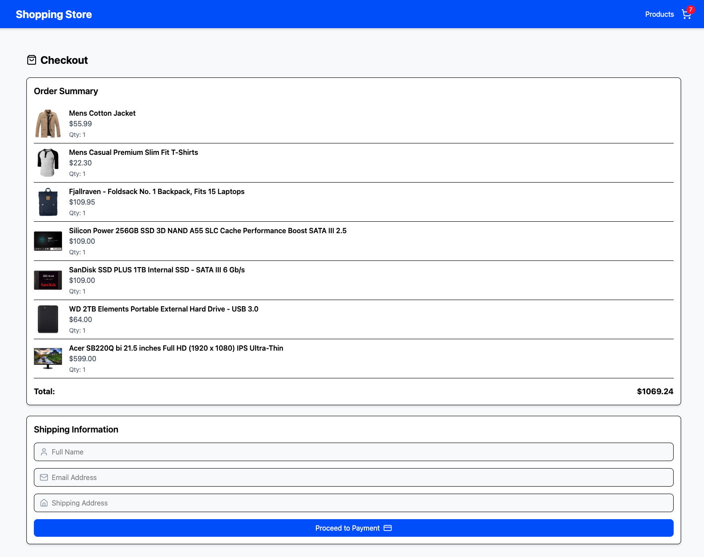
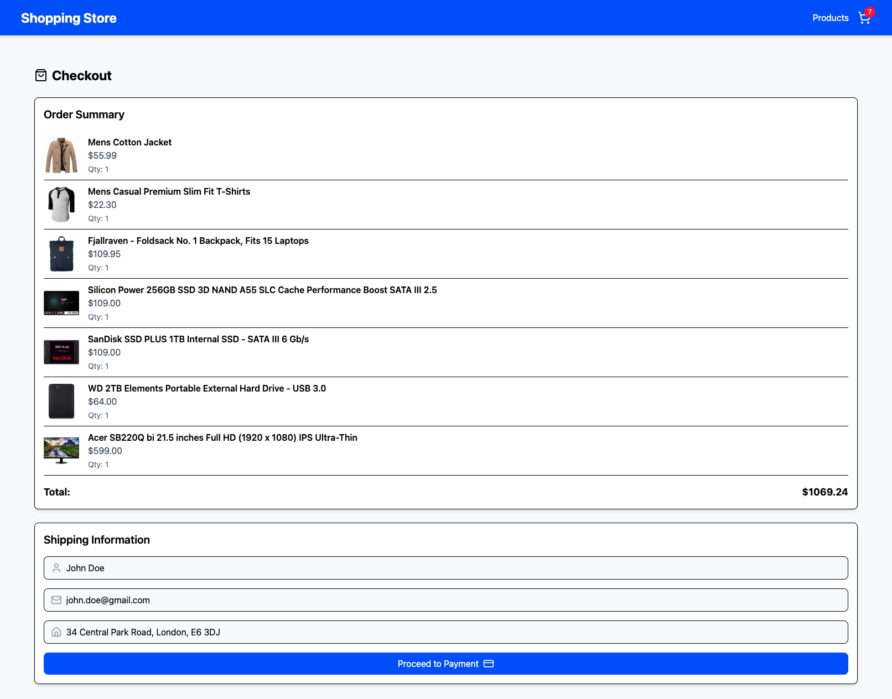
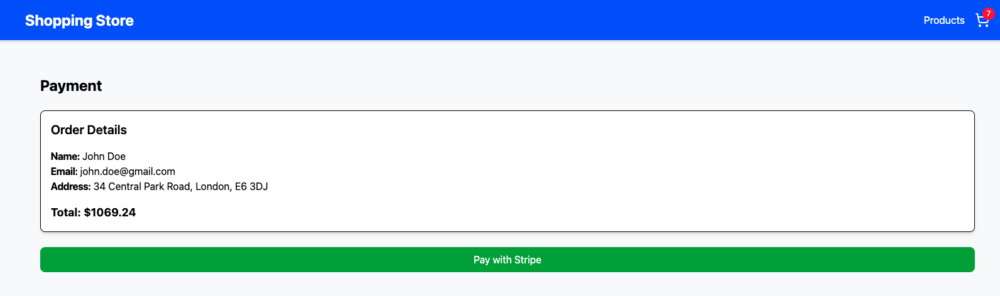

### 🛒 E-Commerce Store - Shopping Cart & Checkout

Overview

This is a modern E-commerce web application built using React 18, TypeScript, Redux, and Vite. The app provides a seamless shopping experience with product filtering, cart management, checkout, and payment integration via Stripe. It follows best practices, including unit testing with Vitest, E2E testing with Cypress, code linting with ESLint, and formatting with Prettier.

🚀 Features

🛍️ Shopping Experience

Dynamic Product Listing - Fetches products from a fake store API.

Category Filtering - Browse products by categories.

Product Details - Display essential details for each product.

Add to Cart - Add products to the shopping cart with a single click.

🛒 Cart Management

View Cart Items - See all added items in the cart.

Update Quantities - Modify item quantities directly in the cart.

Remove Items - Delete specific products from the cart.

Clear Cart - Empty the cart with one click.

Cart Total Calculation - Displays the total price dynamically.

💳 Checkout & Payment

Order Summary - View selected items before finalizing the purchase.

User Information - Collect name, email, and shipping address.

Stripe Payment Integration - Secure payments with Stripe.

🛠️ Development Features

Vite - Lightning-fast development environment.

Redux Toolkit - Efficient state management.

React Router - SPA navigation between product listing, cart, and checkout.

Vitest & Cypress - Unit & end-to-end testing for reliable performance.

Lucide React - Beautiful icons for better UI/UX.

Axios - API requests handling.

Tailwind CSS - Modern styling framework.

ESLint & Prettier - Code linting and formatting for clean code.

📦 Tech Stack

Technology

Purpose

React 18

Frontend library

Vite

Fast development environment

TypeScript

Type safety and better code maintainability

Redux Toolkit

State management

React Router

Client-side routing

Tailwind CSS

Styling framework

Lucide React

Icon library

Axios

API fetching

Vitest & Cypress

Unit & E2E testing

ESLint & Prettier

Code quality and formatting

🛠 Installation & Setup

1️⃣ Clone the Repository

 git clone https://github.com/amir-saeed/ReactJs.git
 cd ecommerce-store

2️⃣ Install Dependencies

npm install

3️⃣ Set Up Environment Variables
Create a .env file in the root folder and add:

VITE_API_BASE_URL=https://fakestoreapi.com/products
VITE_STRIPE_PUBLIC_KEY=your_stripe_public_key

4️⃣ Run the Development Server

npm run dev

5️⃣ Run Tests

# Run Unit Tests
npm run test

# Run Cypress E2E Tests
npm run test:e2e

6️⃣ Build for Production

npm run build

🧪 Testing

This project uses Vitest for unit testing and Cypress for E2E testing.

Unit Testing: Run with npm run test

End-to-End Testing: Run with npm run test:e2e

Code Linting & Formatting:

npm run lint    # ESLint
npm run format  # Prettier

📸 Screenshots

📌 Product Listing

📌 Category Filtering

📌 Shopping Cart

📌 Checkout Page

📌 User Information Input

📌 Stripe Payment Page

📜 License

This project is licensed under the MIT License.

💡 Contributing

Fork the repository.

Create a new branch (feature/your-feature).

Commit your changes.

Open a pull request.

📞 Contact

For any questions or issues, feel free to reach out!

🐙 GitHub: your-username

🚀 Happy Coding! 🎉

